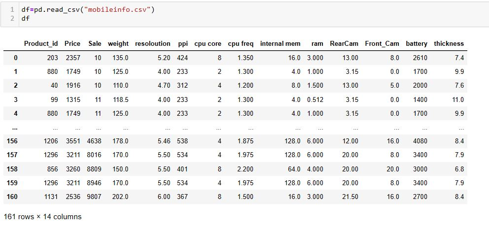
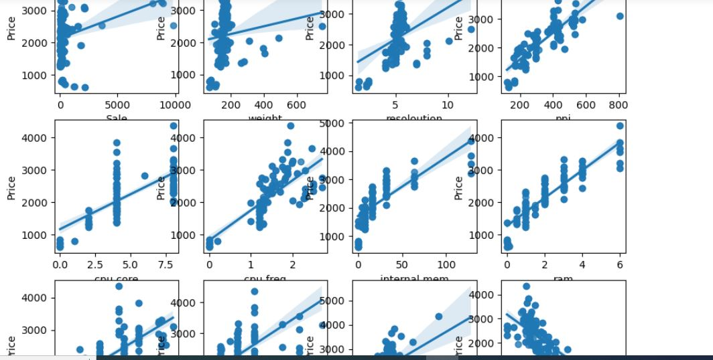

# 
# Mobile-Price-Classification
Predicting the Mobile Price using Linear regression machine learning algorithm ML.

#<h3>Introduction:</h>
    Mobile phones come in all sorts of prices, features, specifications and all. Price estimation and prediction is an important part of consumer strategy. Deciding on the correct price of a product is very important for the market success of a product. A new product that has to be launched, must have the correct price so that consumers find it appropriate to buy the product.

#<h3> Config.py file</h>
Here config file is provided if some one wants to run project on their pc.only change the port number file path.

#<h3> requirements.txt:</h>
    Requirement file is provided to install required labrary and run the program

<h3> ARCHITECTURE DIAGRAM: </h3>


#<h2> Problem Statement<h>
    To predict the mobile price by using following features:
    
    *Sale
    *weight
    *resoloution
    *ppi
    *cpu_core
    *cpu_freq
    *internal_mem
    *ram
    *RearCam
    *Front_Cam*
    *battery
    *thickness

<h2>Data Discription:</h2>Data is obtained from kaggle  and this dataset is used for ML Algorithms. https://www.kaggle.com/datasets/mohannapd/mobile-price-prediction

to gather information:
df=pd.read_csv("mobileinfo.csv")

No of Rows:161

NO of features:14
Attribute breakdown - 12 quantitative inputs, 1 quantitative output 

<h2>Explotarary Analysis And Feature Engineering</h2>
Check the info of data 
    
```
df=pd.read_csv("mobile_info.csv")
```



#3.Explotarory Data Analysis:

3.1

 Product_id: This is unique is column no imapact of this column while predict the value so droped it

```
df=df.drop("Product_id",axis=1)
```

3.2

Sale
In this column numeric data check is there null value present

```
df['Sale'].isna().sum()
```
similary check all features null value no is present...

# 4 feature selection :
    IN feature selection we check the assumption of linear regression.
    4.1 linerity:
        ```
        fig = plt.figure(figsize=(10,8))
    fig.suptitle('Variation of Price')
    plt.subplot(3,4,1)
    sns.regplot(x=df.Sale, y=df.Price)
    plt.subplot(3,4,2)
    sns.regplot(x=df.weight, y=df.Price)
    plt.subplot(3,4,3)
    sns.regplot(x=df.resoloution, y=df.Price)
    plt.subplot(3,4,4)
    sns.regplot(x=df.ppi, y=df.Price)
    plt.subplot(3,4,5)
    sns.regplot(x=df['cpu core'], y=df.Price)
    plt.subplot(3,4,6)
    sns.regplot(x=df['cpu freq'], y=df.Price)
    plt.subplot(3,4,7)
    sns.regplot(x=df['internal mem'], y=df.Price)
    plt.subplot(3,4,8)
    sns.regplot(x=df['ram'], y=df.Price)
    plt.subplot(3,4,9)
    sns.regplot(x=df['RearCam'], y=df.Price)
    plt.subplot(3,4,10)
    sns.regplot(x=df['Front_Cam'], y=df.Price)
    plt.subplot(3,4,11)
    sns.regplot(x=df['battery'], y=df.Price)
    plt.subplot(3,4,12)
    sns.regplot(x=df['thickness'], y=df.Price)   
    plt.show()



#Observation:
 all feetures are linertiy relationship.only thichness is negative side 

5 Model Training:

6.Model Evalution:

Traing accuracy is  95 % and testing accuracy is 92.4 % .model performing well.low bias and low variance


